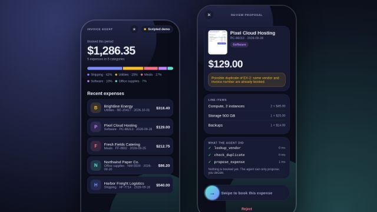

# Invoice Agent

[](https://github.com/juanpablex/invoice-agent/actions/workflows/pages.yml) [](LICENSE) [](https://juanpablex.github.io/invoice-agent/)



A mobile app (Expo / React Native, also runs on the web) where an AI agent reads an invoice and **proposes** an expense, and you **approve it with a swipe**. The agent can never book anything by itself.

**Try it:** https://juanpablex.github.io/invoice-agent/ (best on a phone; or run it with Expo Go, below).

All data is fictional: the vendors, invoices and expenses are made up for this project.

## What is real and what is not

| Part | Status |
|---|---|
| Tools (`lookup_vendor`, `check_duplicate`, `propose_expense`) | **Real code**, shared by both modes. |
| Approval rule | **Real.** No tool books or approves anything. Booking happens in the app, after your swipe. Tested. |
| Default mode ("Scripted demo") | **Scripted.** The three bundled sample invoices have canned extraction; no model reads the image. It exists so the app works for anyone, free. |
| Real-model mode (optional) | **Real, two ways.** In the Claude Artifact copy: **your own Claude account** (no key; the usage counts against your plan; images only, no PDF; tokens are not reported). On Pages and in Expo Go: **bring your own key**. A Claude model reads the invoice (yours: a photo, an image or a PDF up to 5 MB) and drives the same tools. Token counts shown come from the API. |

## Your API key

Optional, and only for the real-model mode.

- You paste your own Anthropic API key in **Settings**. There is no server: requests go straight from your device to the Anthropic API and are billed to your account.
- On a phone the key is kept in the secure keychain/keystore. On the web it stays in sessionStorage (gone when the tab closes) unless you choose to remember it.
- Use a key with a low spending limit, and only on a device you trust.

## Run it

```bash
npm install
npx expo start          # scan the QR code with Expo Go
npm run typecheck
npm test                # agent loop and approval rule, with a fake model (no key, no network)
npm run build:web       # static web build in dist/
npm run build:artifact  # web build for a claude.ai Artifact in dist-artifact/ (in-memory router, relative paths)
```

Sample invoice images are generated by `scripts/make-samples.mts` (needs Playwright).

## Project layout

- `src/core`: tools and ledger, agent loop (scripted and Claude), sample data. No UI code.
- `src/app`: screens (Expo Router): home, scan, review, settings.
- `src/ui`: swipe-to-approve, press feedback, animated count-up, backdrop. `src/theme.ts` holds the design tokens.

## License

MIT
